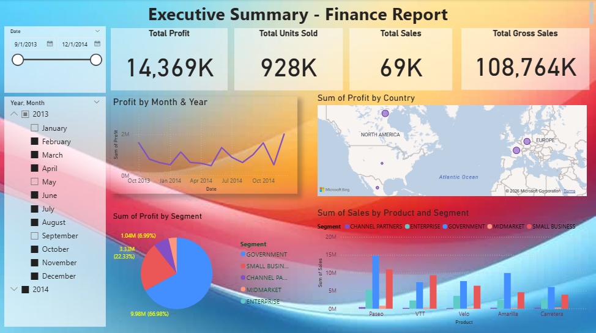

# Finance Dashboard (Power BI)

## Finance Dashboard - https://github.com/jyotisharma-cyber/Finance

---
## Finance Dashboard Screenshot



---

##  Project Overview

The **Finance Dashboard** is an interactive Power BI report designed to provide executives and business stakeholders with a comprehensive overview of financial performance. The dashboard enables users to monitor profitability, sales performance, product trends, and regional contributions through dynamic visualizations and filters.

---

##  Project Objectives

- Track overall financial performance.
- Monitor profit and sales metrics.
- Analyze product-wise sales performance.
- Evaluate profitability across business segments.
- Compare trends over time.
- Identify high-performing countries and products.
- Support strategic business decision-making.

---

##  Key Performance Indicators (KPIs)

| KPI | Value |
|------|--------|
| Total Profit | 14,369K |
| Total Units Sold | 928K |
| Total Sales | 69K |
| Total Gross Sales | 108,764K |

---

##  Dashboard Insights

### Profit Trend Analysis
- Monthly profit trends are visualized to identify growth patterns and seasonal fluctuations.
- Enables comparison of performance across different months and years.

### Profit by Segment
The dashboard analyzes profit contributions from business segments such as:

- Government
- Small Business
- Channel Partners
- Midmarket
- Enterprise

### Sales by Product & Segment
Provides detailed sales analysis across products including:

- Paseo
- VTT
- Velo
- Amarilla
- Carretera

Users can compare sales performance across different customer segments.

### Profit by Country
Geographical analysis highlights profit contributions from different countries, helping identify strong and weak markets.

### Date-Based Analysis
Interactive date filters allow users to:

- Analyze specific time periods
- Compare yearly performance
- Monitor monthly trends
- Evaluate seasonal sales patterns

---

##  Tools & Technologies Used

- **Power BI Desktop**
- **Power Query**
- **DAX (Data Analysis Expressions)**
- **Data Modeling**
- **Microsoft Excel**
- **Business Intelligence & Data Visualization**

---

##  Dataset Information

The dataset contains financial information such as:

- Date
- Product
- Segment
- Country
- Units Sold
- Sales
- Gross Sales
- Profit
- Discounts
- Cost of Goods Sold (COGS)

---

##  Dashboard Features

1. Executive-Level KPI Summary

2. Interactive Date Slicers

3. Profit Trend Analysis

4. Product Performance Tracking

5. Segment-Wise Profit Analysis

6. Country-Level Profit Visualization

7. Dynamic Filtering & Drill-Down

8. Business Performance Monitoring

---

##  Business Benefits

- Improve financial decision-making.
- Identify profitable products and markets.
- Track business growth over time.
- Monitor segment performance.
- Detect sales opportunities and risks.
- Support executive reporting and strategic planning.

---

##  How to Use

1. Download the `.pbix` file.
2. Open the report in Power BI Desktop.
3. Refresh the dataset if required.
4. Use the Date and Year filters to analyze specific periods.
5. Explore product, segment, and country-level insights.

---

##  Project Structure

```text
Finance-Dashboard/
│
├── Finance_Dashboard.pbix
├── Financial_Dataset.xlsx
├── Finance.PNG
└── README.md
```

---

##  Key Visualizations

- KPI Cards
- Line Chart (Profit Trend)
- Pie Chart (Profit by Segment)
- Clustered Column Chart (Sales by Product & Segment)
- Map Visualization (Profit by Country)
- Interactive Slicers

---

##  Author
## Jyoti Kashyap

 Aspiring Data Analyst

 Skills: Power BI, Excel

🔗 GitHub: https://github.com/jyotisharma-cyber

---

##  Support

If you found this project helpful, please consider giving it a ⭐ on GitHub.

Feedback and suggestions are always welcome!
